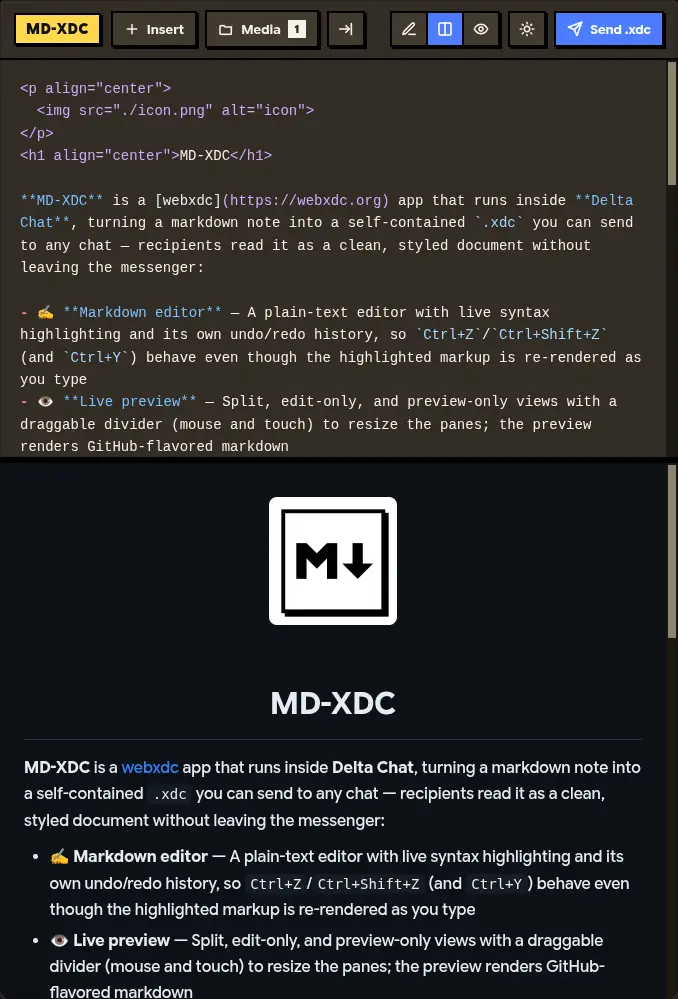

  

<h1 align="center">MD-XDC</h1>

**MD-XDC** is a [webxdc](https://webxdc.org) app that turning a markdown note into a self-contained `.xdc` you can send to any chat — recipients read it as a clean, styled document without leaving the messenger:

- ✍️ **Markdown editor** — A plain-text editor with live syntax highlighting and its own undo/redo history, so `Ctrl+Z`/`Ctrl+Shift+Z` (and `Ctrl+Y`) behave even though the highlighted markup is re-rendered as you type
- 👁️ **Live preview** — Split, edit-only, and preview-only views with a draggable divider (mouse and touch) to resize the panes; the preview renders GitHub-flavored markdown
- 🖼️ **Media** — Insert images, video and audio from one picker (a mixed batch is fine — each file's kind is inferred automatically); files are stored in a media library (IndexedDB) where you can insert, copy the link, or delete them
- 🌐 **RTL support** — One click flips the document direction; the exported note follows, with code blocks kept LTR
- 🎨 **Light & dark themes** — The app, the preview and the exported note all share the palette; the exported note keeps its own theme toggle and A+/A− text-size buttons
- 📱 **Responsive & touch-friendly** — The header and panes adapt down to phone widths, and the divider is drag-usable on touch screens
- 🔒 **Fully offline** — All libraries (marked, client-zip, speed-highlight) are vendored under `lib/`; no CDN, no build step
- 📦 **Send .xdc** — The send dialog lets you set the app name and pick a custom icon (or keep the default `icon.png`), then packs everything — note, media, viewer, icon — into a `.xdc` and sends it to the chat; if the messenger's send API is unavailable, it falls back to a download

## Screenshot

## Development

The app is plain HTML/CSS/JS with no build step. Open `index.html` directly in a browser (or serve the directory with any static file server) to develop — outside a messenger the `webxdc.js` stub is loaded as-is, so sending falls back to downloading the `.xdc` locally instead.

To test real chat integration, package the app directory into a `.zip` archive, rename the extension to `.xdc`, and send it into any supported messenger (like Delta Chat).
